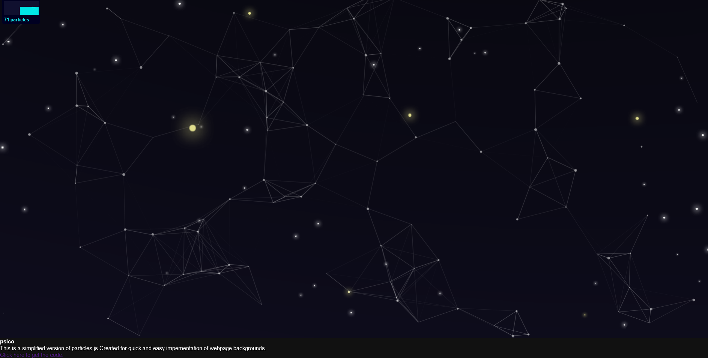

  

  
    
    
  
  
    
    
    
  

# easy-particles.js

Interactive web page with random movement of particles , clickable. repo migrated here when i locked myself out of 

psico-mojo repo... makes an engaging web page bg... based on 'particles.js

version of particles.js with added http server to aid viewing changes made during the development stage.

the main purpose of this repo is for the quick and easy development of responsive web page backgrounds.

Attempting to 'touch' any particle results in 'repulsion' , you can chase them around the screen

with your cursor , click ' onscreen' to generate more particles and increase the complexity of the

environment...

Add a new background image from a local or remote source in the "url" field in "styles.css" .

Populate your "index.html" with some web page stuff and you are good to go...

# install

clone the repo ; https://github.com/psico-mojo/easy-particles.js.git

alt ; https://github.com/Mulc1b3R/easy-particles.git

'npm install'...           this adds the dev server.

'npm start' ...             this starts the dev server on ;  localhost:3000/ 

#demo

view the live demo here ; https://easy-particles-js.vercel.app/       

